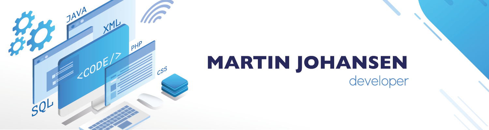

   

### Hello there 
My Name is Martin Johansen, I'm a Norwegian web and app developer. I currently work as CTO @ Share-Park.
I started as a web developer back in 2014 when I was offered a chance to take over the development of an admin panel for a call of duty 4 server.
I leaped into action and started learning PHP and MySQL with JQuery.

A few years later I would graduate from NTNU with a Bachelor's degree in Web development and help make Share-Park into a company.

 

- 💼 In need of a freelancer? [Send me an email](mailto:martin@share-park.app)
- 💬 Ask me anything, I'm happy to help
- 👏 View me on [Linkedin](https://www.linkedin.com/in/martin-johansen-a32a00173/)

 

### Languages and Tools:

##### Web Development
<code></code>
<code></code>
<code></code>
<code></code>
<code></code>
<code></code>

##### App Development
<code></code>
<code></code>
<code></code>

##### Backend
<code></code>
<code></code>
<code></code>

##### Database
<code></code>
<code></code>
<code></code>

##### Data Visualization
<code></code>
<code></code>
<code></code>

##### Tools and Software
<code></code>
<code></code>
<code></code>
<code></code>
<code></code>
<code></code>
<code></code>

    

